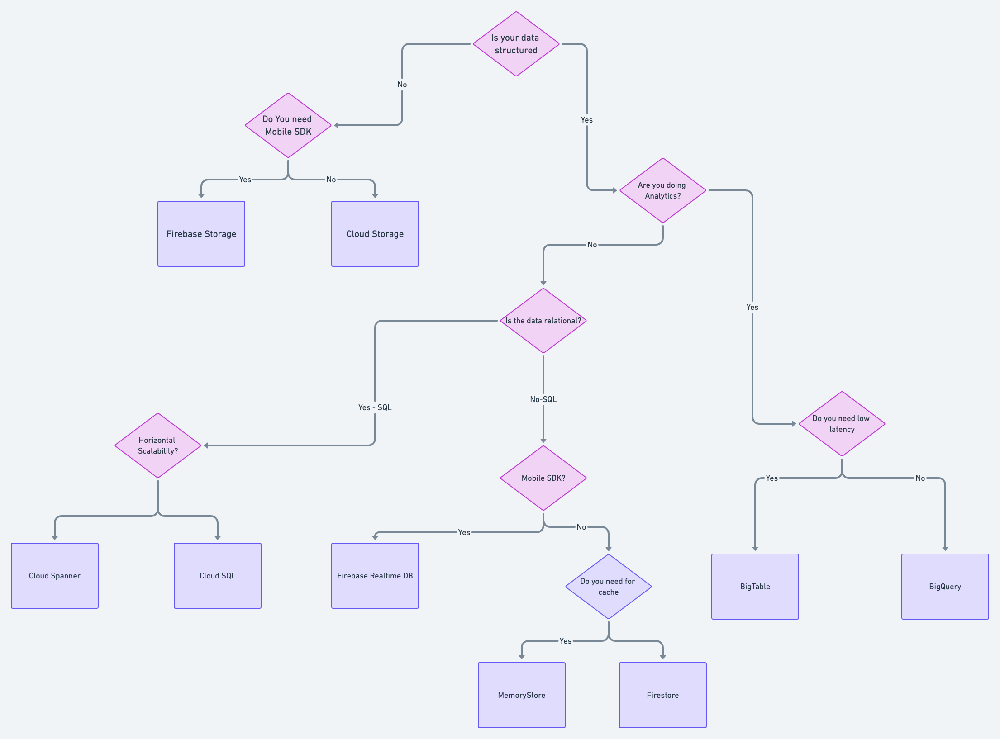

# Selecting the right database in Google Cloud

About GCP

Google Cloud Platform (GCP), offered by Google (company), is a suite of cloud computing services that runs on the same infrastructure that Google uses internally for its end-user products, such as Google Search, Gmail, file storage, and YouTube.[3] Alongside a set of management tools, it provides a series of modular cloud services including computing, data storage, data analytics and machine learning.[4] Registration requires a credit card or bank account details.[5]

- You can always go and setup any open-source database on your own on a google virtual machine compute engine however google cloud provides an extensive set of fully managed database services. "Era of Fully Managed"
    - Firebase Storage
    - Cloud Storage
    - Cloud Spanner
    - Cloud SQL
    - Memorystore
    - Firestore
    - Big Table
    - Big Query
- Nowadays, choosing the right cloud-based product for your big data and machine learning workloads is a critical skill you will have to learn
- The most important of all is choosing the right database for your use cases.
- With so many options in cloud at our disposal with a click of a button can sometimes be overwhelming or confusing

## Flowchart on selecting the right database

[**https://whimsical.com/choosing-the-right-database-in-gcp-M7L3jcgNZSiLqhF5nPxTxK**](https://whimsical.com/choosing-the-right-database-in-gcp-M7L3jcgNZSiLqhF5nPxTxK)

## GCP Database

[https://cloud.google.com/products/databases](https://cloud.google.com/products/databases)

**Google Cloud Platform (GCP)**

**Cloud SQL:**

- Manage a database using Infrastructure as Code (IaC)
- Fully managed relational databases lowers maintenance costs
- Ensures increased serviceability with automated database provisioning, fair storage capacity, and database management
- Default size is 10TB, you can add 400GB RAM and 30 TB storage for scalability
- Easy Integration with Google Cloud services and other applications
- One click replication of your instance to other region
- Automatic backups, achieve application compatibility and external migration of on-premises MYSQL database
- Ability to handle complex queries and multiple transactions simultaneously

**Cloud Spanner:**

- High reliability with zero downtime
- Gain from consistent performance across regions and continents
- No restriction of minimum and maximum size
- Efficient handling of replicas and automatic sharding of data on request load
- Easy deployment irrespective of database size
- Storage capacity of Petabytes ensures load handling
- Change schema without affecting the traffic
- Tested for 99.99% availability of database
- Backup and restoration available on demand
- Capable to store billions of data on daily basis

**BigQuery**

- Storage 10TB free per month
- 1TB of query data processing free every month
- A serverless service enables processing of data automatically for multiple machines working simultaneously
- Built-in data transfer service for data migration from on-premises to cloud
- Can process data stored in other GCP products
- Store data in a columnar database for faster read and response rate
- Automatic encryption of data when at rest on in transit

**Cloud Bigtable**

- No SQL database
- High availability of 99.99% and zero downtime even during reconfiguration
- Consistent sub-10ms latency can handle millions of requests every second
- Seamless scaling with dynamic support for hundreds of nodes
- Increase the Bigtable cluster size without any downtime
- Flexible automated replication increases availability and isolation of workloads for live apps
- Data repair and synchronizing the updates in data requires no manual intervention
- Easy connect with other Google Cloud services
- Designed to store the ML applications

**Cloud Firestore**

- No SQL Google Cloud database can scale up effortlessly
- Can store up to 1GiB which 20M chat messages
- Easy integration with Firebase and Google Cloud services
- Lets you run atomicity, consistency, isolation, and durability (ACID) transactions against the document data
- Built-in sync accelerates the development of real time applications
- Store, and synchronize query data for mobile, web and IoT applications
- Customizable security and data validations for protection of data

**Firebase Realtime Database**

- No SQL Google Cloud database that enables storage and data sync in real-time.
- Easy collaboration across devices for speedy and accurate access of data from web or mobile apps
- Realtime Database software development kits (SDKs) for faster app development
- Increase app engagement cloud messaging and other cloud functions

**Cloud Memorystore**

- Automates complex tasks for building applications at a high pace
- Fully compatible with Redis and Memcached
- Supports large clusters of 5TB
- Enables you to build application caches that provide sub-millisecond latency
- Low latency assists high speed data access and data transfer
- Redis instances are replicated in two zones for 99.99% availability
- Automated provisioning and replication
- Cloud monitoring and integration with OpenCensus for better insights
- Easy migration as no change in code required to switch applications

[Comparison of database services](comparision.html)

# Choosing the right database